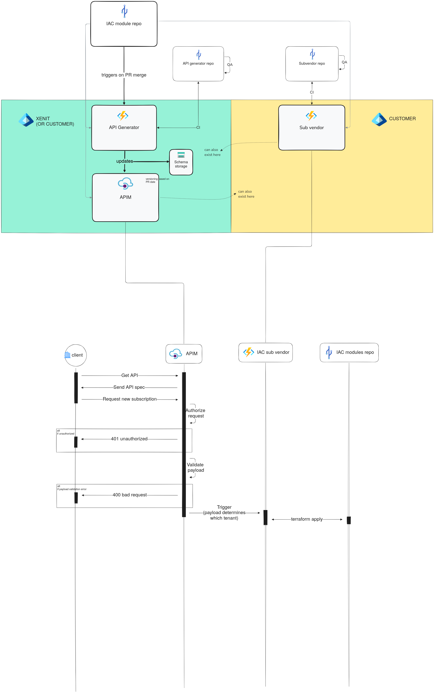

### TODO: 
~~- [ ] subvendor API generator sandbox to fix schema format~~
~~     - [ ] fix json schema so it includes all variables.tf~~
~~     - [ ] remove "variables.tf" from schema field name~~

~~- [ ] use schema in APIM~~
...
- [x] write subvendorIACProvisioner function app
- [ ] write proper variables.tf for subscription IAC

## subvendor API generator

## subvendor IAC provisioner

## IAC
unless you have a CSP, EA, or MCA with Azure, terraform apply results in:
```
module.subscription.module.lz_vending.module.subscription[0].azapi_resource.subscription[0]: Creating...
╷
│ Error: Failed to create/update resource
│
│   with module.subscription.module.lz_vending.module.subscription[0].azapi_resource.subscription[0],
│   on .terraform/modules/subscription.lz_vending/modules/subscription/main.tf line 2, in resource "azapi_resource" "subscription":
│    2: resource "azapi_resource" "subscription" {
│
│ creating/updating Resource: (ResourceId "/providers/Microsoft.Subscription/aliases/my-subscription-alias" / Api Version "2021-10-01"): PUT
│ https://management.azure.com/providers/Microsoft.Subscription/aliases/my-subscription-alias
│ --------------------------------------------------------------------------------
│ RESPONSE 401: 401 Unauthorized
│ ERROR CODE: UserNotAuthorized
│ --------------------------------------------------------------------------------
│ {
│   "error": {
│     "code": "UserNotAuthorized",
│     "message": "User is not authorized to create subscriptions on this enrollment account"
│   },
│   "code": "UserNotAuthorized",
│   "message": "User is not authorized to create subscriptions on this enrollment account"
│ }
│ --------------------------------------------------------------------------------
│
╵
```

## Notes
logic app har begränsningar
cross tenancy är inte garanterat
“ägare”
komplexitet, underhåll, och framtida iterationer
hela min lösning genom IAC
function app storage acc, inte utforskat skillnader mellan v1 och v2, anonymous access osv
app service plans för function apps, pricing plans för APIM
managed identity, rbac, guest tenant
gick från https://melvinkoh.me/parsing-terraform-for-forms till python-hcl2, och från python-terraform (unmaintained) till native terraform
i samma veva; fast än gitpython maintained, går det att göra utan den också
~~schemat kan bli komplext, beroende på IAC-koden, och man vill inte lägga ansvaret till utomstående att ta hänsyn till subvendorn~~
root variables.tf är vad som tar hand om att passa ner variabler till moduler, så logic-appen behöver inte gå igenom alla variables.tf rekursivt alls
openapi schemas har andra naming conventions än terraform-moduler, så vi byter från . till _, exempelvis, men vi matar in variabler till terraform och terraform-modulerna kan förvänta sig andra namn. Detta öppnar öppnar krav till en tredje part
https://github.com/Azure/azure-functions-openapi-extension denna finns för C#
route params fungerade inte helt enkelt, inte ens med exemplet på ms docs, tog ~1h av min tid (Commit 50caacd https://learn.microsoft.com/en-us/azure/azure-functions/functions-bindings-http-webhook-trigger?tabs=python-v2%2Cisolated-process%2Cnodejs-v4%2Cfunctionsv2&pivots=programming-language-python#customize-the-http-endpoint )
man kan inte bryta sig ut ur en foreach loop i en logic app utan hacky workarounds
terraform docs rekommenderar emot att köra IAC genom en function app lmao
containerization adds significant complexity due vscode not supporting containerized function app deployments, and having to manage a container registry
Initialt letade logic-appen rekursivt efter varje variables.tf-fil i hela repot, och delade in API-schemat i olika objekt som då representerade variabler till olika moduler. Tanken var att main.tf skulle mata in variablerna beroende på vad konsumenten vill provisionera. 
